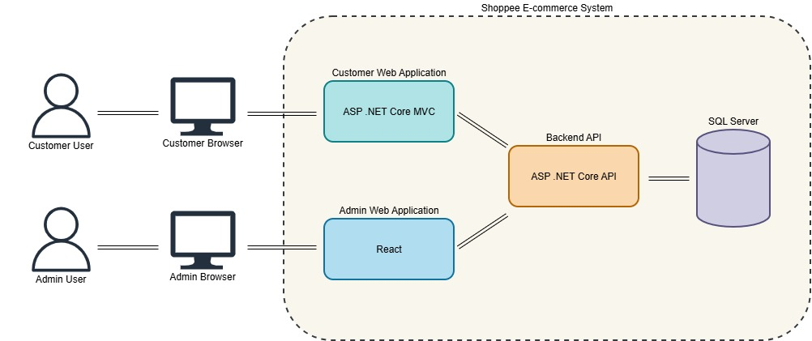
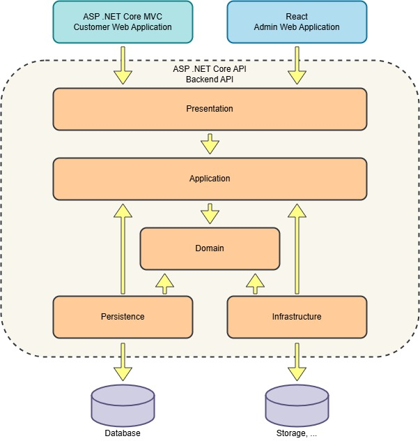

# Shoppee Ecommerce

A comprehensive full-stack e-commerce solution built with a modern .NET backend and decoupled frontend applications.

This project demonstrates a modular architecture involving a central API, a consumer-facing MVC portal, and a React-based administrative dashboard.

> This is a learning project for building an ecommerce system. Feel free to discuss and provide suggestions.

## 🧩 System Architecture

The project is designed as a monorepo, with 3 main components:

- **Backend API:** An ASP .NET Core Web API serving as the central data and logic hub.
- **Customer Site:** An ASP.NET Core MVC application for end-users to browse and purchase products.
- **Admin Portal:** A React application for managing categories, products and orders.

The API application follows Clean Architecture.

## 🚀 Application Features

### Backend API (ASP.NET Core API)

The backbone of the system, handling business logic, data persistence, and security.

- **Authentication & Authorization:** Secure identity management using JWT Access and Refresh token flows.
- **Product Engine:** Manages complex product data and categorization.
- **Cart Service:** Handles shopping cart data and operations for guest and authenticated users.
- **Order Serivce:** Handles the lifecycle of a purchase from cart validation to final order placement.
- **Payment Service:** Provide operations to manage orders payment state.
- **Global Exception Handling:** Centralized middleware to ensure consistent error responses using the Result pattern.

### Customer Site (ASP.NET Core MVC)

A high-performance, SEO-friendly storefront built for the end-user experience.

- **Product Discovery:** Responsive catalog with category-based navigation and search.

- **Shopping Experience:** Integrated cart system allowing users to manage items before checkout.

- **Checkout Workflow:** Secure multi-step process to capture shipping details and finalize orders.

- **Orders Management:** Intuiative orders history system, providing users with fast and effective ways to manage placed orders.

### Admin Portal (React)

A data-driven dashboard designed for internal management and oversight.

- **Products Management**: Manage products through products listing, product creatation and alteration.
- **Categories Management**: Create and manage categories for better product categorization.
- **Orders Management**: View customers' orders information and manage order's states.
- **Customers Management**: View and manage system's customers.

## ⚙️ Tech Stack

### Backend API (ASP.NET Core API)

**Core Framework:** ASP.NET Core for building high-performance, cross-platform web APIs.

**Architecture Pattern:** Clean Architecture utilizing:

- **MediatR:** For implementing the CQRS pattern to decouple read and write operations.

- **ApiEndpoints:** A REPR (Request-Endpoint-Response) pattern approach, moving away from bloated Controllers for better maintainability.

- **Specification Pattern:** Powered by Ardalis.Specification to encapsulate query logic and keep the domain layer clean.

- **Result Pattern:** Using ErrorOr (or FluentResults) for expressive, functional error handling in domain services.

**Data Persistence:**

- **Database:** SQL Server.

- **ORM:** Entity Framework Core with a code-first approach and automated migrations.

**Security & Identity:**

- **Authentication:** Custom JWT (JSON Web Token) implementation.

- **Token Management:** Robust Access and Refresh Token flow for secure, long-lived sessions without Identity Server.

**Real-time Features:** SignalR status updates (e.g., order tracking).

**Integrations & Third-Party Services:**

- **Payment Gateway:** Stripe API for secure, PCI-compliant payment processing.

- **Media Management:** Cloudinary for optimized cloud-based image storage and transformations.

**Quality & Validation:**

- **FluentValidation:** For strictly typed, declarative validation of DTOs and commands.

### Customer Site (ASP.NET Core MVC)

- **Core Framework:** ASP.NET Core MVC (Model-View-Controller) for server-side rendering.

- **Dynamic UI (HTMX):** Utilizes HTMX to perform partial page updates and AJAX requests directly from HTML attributes, providing a Single Page Application (SPA) feel without the complexity of a full JavaScript framework.

**Styling & Components:**

- **Tailwind CSS:** A utility-first CSS framework for rapid UI development.

- **DaisyUI:** A component library built on top of Tailwind for polished, accessible UI elements.

- **API Communication:** Refit (The automatic type-safe REST library) for making clean, interface-driven calls to the Backend API.

### Admin Portal (React)

**Core Framework:** React with TypeScript for robust, type-safe frontend development.

**Build Tooling:** Vite for lightning-fast development and optimized production builds.

**Data Management:**

- **TanStack Query (React Query):** For powerful server-state management, caching, and synchronization.

- **Axios:** The underlying HTTP client for specialized API communication.

**Advanced Data Display:** TanStack Table (Headless UI) for building highly functional data grids with complex sorting and filtering.

**User Interface:**

- **shadcn/ui:** High-quality, accessible components built with Radix UI and Tailwind.

- **dnd-kit:** A modular toolkit for implementing smooth Drag and Drop experiences (e.g., for reordering images or categories).

**Forms & Validation:**

- **React Hook Form:** For performant, flexible form state management.

- **Zod:** Schema-based validation to ensure data integrity before submission.

**Navigation:** React Router for declarative, client-side routing.
